# Throwaway — Claude implementation plan

Date: 2026-10-08 · Scope: C9 / Week 10 real-time interaction, followed by completion of the full Final MVP.

This document gives Claude an implementation plan. The current delivery contains only this file and `reference-images/`; no application implementation, database changes, commits, pushes or deployment have been performed. Follow this plan when the user assigns the implementation work. Reading this document alone does not authorize publishing, modifying production data or changing repository visibility.

## 1. Starting point, sources and delivery scope

Repository: `comp4020-final-aurorasundev`.

Current local checkout: `/Users/aurora/Desktop/26S2/COMP8020/code/comp4020-final-aurorasundev/`. If this package is moved, use the actual repository root rather than assuming this local path still applies. Source paths in Section 11 are relative to the repository root.

The user has completed the foundation. Extend the existing implementation using the original complete product plan and the reevaluated SSE approach. Do not rebuild the project or treat an earlier week's delivery boundary as the final feature scope.

Primary sources:

- [Original complete product plan: Product Brief, Final MVP and Definition of Good](https://chatgpt.com/share/6ac39a5c-ca44-83ec-b582-ae042218c2a0)
- [C9 / Week 10: All at once](https://comp.anu.edu.au/courses/comp4020-agentic-coding-studio/crits/09-all-at-once/)
- [Official Final Project requirements](https://comp.anu.edu.au/courses/comp4020-agentic-coding-studio/assessments/final-project/)
- Current source code, README, existing course checks and the reference images accompanying this document.

Implementation has two levels of completion. The second remains part of the plan:

| Level | Completion criteria |
| --- | --- |
| C9 priority increment | Deployed changes appear across sessions within about one second; one decision about multi-user behavior is recorded in an ADR; process records and the week's reflection are grounded in actual work |
| Complete Final MVP | Keep / Release, immutable submissions, random exploration, intentional witnessing, permission-based destruction, final reading, return keys, automated moderation, reporting and necessary logging work together end to end |

Orphaned Gallery, AI symbolic artifacts and advanced spatial effects remain optional extensions. They are outside the default implementation scope. Do not build empty pages, database frameworks or placeholder entry points for them.

The repository's CLAUDE.md still contains earlier scope restrictions. At the start of implementation, update its scope and relevant rules to match this plan, retaining valid constraints on identity, persistence, immutability, logging and course checks. Do not use outdated restrictions to remove the real-time or permission features in this plan.

## 2. Product principles to preserve

Complete core loop:

`write → choose Keep or Release → confirm → approve submission → persist → crumple → throw → encounter → open → witness → possibly disappear`

1. Throwaway is a shared physical ritual for putting things down. A paper's words appear only after someone deliberately opens it.
2. The paper pool and its lifecycle are shared; random placement and physics are rendered locally.
3. Do not add a latest feed, search, popularity ranking, profiles, My Papers, author pages, comments, likes or follows.
4. Content and the Keep / Release mode become immutable after a successful submission. Enforce this on the server.
5. Keep preserves the author's final right to destroy the paper. Release removes the author's special destruction rights.
6. Opening is not witnessing. Record a witness only after an intentional click on `I saw it`.
7. Show witness counts only inside an opened paper. Do not use them for discovery or ranking or include them in unopened-paper list responses.
8. Destruction requires an explicit user action and server permission checks. Do not add bulk destruction, points, countdowns or rewards.
9. Normal destruction respects active readers. Moderation quarantine is a separate state and does not receive the final-reading exception.
10. A return key restores rights and witness identity continuity, without restoring a personal history.

All interface text must be English, including examples, errors, connection states, confirmations and helper text. This implementation plan is also in English.

## 3. Technology stack and selection rationale

| Area | Technology | Claude's task |
| --- | --- | --- |
| Pages and dialogs | Existing React 19 + TypeScript + Vite | Extend current components and state; retain the two public page routes |
| Layout and paper surfaces | Existing CSS tokens, native form controls and a separate texture layer | Match reference dimensions, spacing and paper texture; keep text and interactions in HTML |
| Crumpled paper and physics | Existing Three.js 0.160.x + cannon-es | Retain the paper-crumple-demo wrapper; keep per-frame state in the scene rather than React |
| Animation | Existing demo, CSS / Web Animations | Add small scene events and transitions; do not add GSAP or another animation dependency by default |
| Server | Existing Express 5 + Node 24 | Handle creation, witnessing, destruction, identity recovery and reporting over HTTP; send confirmed changes through same-origin SSE |
| Data and permissions | better-sqlite3 + SQLite WAL | Implement transactions, constraints, migrations and persistent versions; map identities through server cookies |
| Real-time reception | Native browser EventSource / SSE | Use one stream per page instance; reconcile with an authoritative snapshot on reconnect |
| Deployment | Existing Fly.io single instance and /data volume | Preserve the course deployment arrangement; verify streaming is not buffered |
| Business checks | Existing Vitest + HTTP checks against the running application | Retain course invariants; add checks for identities, concurrency, real-time updates and recovery |
| Visual checks | Browser / IAB; Playwright Chromium if unavailable | Compare actual desktop, mobile and resized views with their references |
| Automated moderation | Server calls to a confirmed and configured moderation service | Provider and credentials are prerequisites; see Section 10. Keep secrets on the server and use real moderation results |

Real-time choice: SSE + HTTP. Creation, witnessing, destruction and quarantine are discrete changes confirmed by the server. Local dragging, camera movement and crumpling do not need continuous two-way transmission.

| Alternative | Why it is not selected / when to reconsider |
| --- | --- |
| Socket.IO | Reconnection, broadcasting, rooms and two-way communication are available, but continuous two-way synchronization is unnecessary here. Reevaluate if shared cursors, dragging or fixed world coordinates become requirements |
| Native WebSocket | Adds connection management such as reconnection and heartbeats without enough current product benefit |
| Fast polling every 250–500ms | Sends requests even when nothing changes; timer and request delays add latency. Do not use it as the normal synchronization method |

Automatic SSE reconnection does not restore missed business state. Socket.IO defaults also do not guarantee recovery of every missed event. The explicit choice here is to recover current facts on reconnect, without replaying the full history.

Technical sources: [SSE / EventSource](https://developer.mozilla.org/en-US/docs/Web/API/Server-sent_events/Using_server-sent_events), [Socket.IO](https://socket.io/docs/v4/) and [Socket.IO delivery guarantees](https://socket.io/docs/v4/delivery-guarantees/).

## 4. How Claude must use the reference images

**Open each specified image before implementing its corresponding area. After implementation, compare an actual screenshot with that image point by point. These images are visual targets: reading their filenames or borrowing only the palette is insufficient.**

The images are design references, not application screenshots or evidence of completed work. Do not use a whole image as a page background or crop its text, buttons or dialogs to implement the interface. All text, input, selection and actions must remain accessible HTML.

Numbers, body text and return keys shown in the images are examples. Use the exact English copy in Section 14, actual server values for numbers and genuine random generation for keys. If generated text contains a minor spelling variation, follow the plan's copy.

Desktop images are approximately 1672 × 941. Mobile images are approximately 853 × 1844, with the layout proportions of a 390 × 844 viewport. These are image dimensions, not CSS dimensions. Also verify the course's 1920 × 1080 and 390 × 844 viewports and a normal laptop window. Match proportions and responsive behavior rather than hardcoding image pixels.

### Package portability and relative image paths

Every Markdown image and image-file link in this document uses a relative path beginning with `reference-images/`. It resolves from the directory containing `plan.md`, independently of the old absolute workspace location.

Move `plan.md` and `reference-images/` together, retaining this structure:

```text
<any destination directory>/
├── plan.md
└── reference-images/
    ├── 01-space-desktop.png
    ├── 02-write-desktop.png
    ├── 03-read-desktop.png
    ├── 04-final-read-desktop.png
    ├── 05-return-key-desktop.png
    ├── 06-readme-desktop.png
    ├── 07-space-mobile.png
    ├── 08-write-mobile.png
    ├── 09-read-mobile.png
    ├── 10-readme-mobile.png
    ├── 11-burn-confirm-desktop.png
    └── 12-report-desktop.png
```

For example, `` continues to resolve if this structure is placed at the repository root or inside a subdirectory such as `docs/implementation/`. Moving only the document, renaming the image folder or changing their relative locations requires updating the links.

| ID | File | Reference purpose |
| --- | --- | --- |
| D01 | [01-space-desktop.png](reference-images/01-space-desktop.png) | Shared space, realistic paper material, live arrival, navigation, counter and main action |
| D02 | [02-write-desktop.png](reference-images/02-write-desktop.png) | Write layout, input, mode selection, confirmation and footer actions |
| D03 | [03-read-desktop.png](reference-images/03-read-desktop.png) | Read spacing, witnessing, pending destruction eligibility and report entry |
| D04 | [04-final-read-desktop.png](reference-images/04-final-read-desktop.png) | Final reading after someone else destroys the paper |
| D05 | [05-return-key-desktop.png](reference-images/05-return-key-desktop.png) | Return-key input; the first-issuance variant uses the same paper system |
| D06 | [06-readme-desktop.png](reference-images/06-readme-desktop.png) | Single-column Readme article |
| M01 | [07-space-mobile.png](reference-images/07-space-mobile.png) | Mobile shared space and reachable main action |
| M02 | [08-write-mobile.png](reference-images/08-write-mobile.png) | Mobile Write order, controls and compact spacing |
| M03 | [09-read-mobile.png](reference-images/09-read-mobile.png) | Mobile Read font size, paper margins and vertical actions |
| M04 | [10-readme-mobile.png](reference-images/10-readme-mobile.png) | Scrollable mobile article; the first viewport does not truncate the real README |
| D07 | [11-burn-confirm-desktop.png](reference-images/11-burn-confirm-desktop.png) | Inline destruction confirmation for a Keep author |
| D08 | [12-report-desktop.png](reference-images/12-report-desktop.png) | Separate report state on the same paper, without nested dialogs |

For mobile final reading, combine D04's state with M03's layout. For mobile return keys, destruction confirmation and reporting, combine the controls in D05 / D07 / D08 with the width and scrolling rules in M02 / M03. Do not create another visual system.

## 5. Visual system and paper material

### 5.1 Design parameters

| Element | Target |
| --- | --- |
| Space background | Light warm grey near #e7e4de, with a soft ground-to-background transition |
| Paper base color | Restrained ivory between #eee9df and #f3f0e8, refined against the relevant reference |
| Main text | Clear dark ink near #292927 |
| Secondary text / lines | Retain the existing muted / line tokens; texture must not hinder reading |
| Fonts | Existing Georgia / Times serif for branding and headings; system sans-serif for body and controls; monospace may be used for keys |
| Desktop brand / heading | Brand approximately 42–48px; Write heading approximately 30–36px; reference proportions take priority |
| Body text | Desktop Read approximately 20–23px; mobile Read 18px; line height 1.6–1.7 |
| Form and helper text | Inputs at least 16px; ordinary helper text approximately 14–16px, with readable contrast |
| Controls | Buttons approximately 48–52px high; mobile touch targets at least 44px |
| Spacing | Desktop paper padding approximately 48–64px; mobile approximately 24–28px; prefer 8/12/16/24/32 spacing increments |
| Dialog shape | A single sheet with slightly irregular edges, restrained folds and soft contact shadows; avoid thick rounded white cards |

### 5.2 Crumpled 3D paper: use D01 and M01

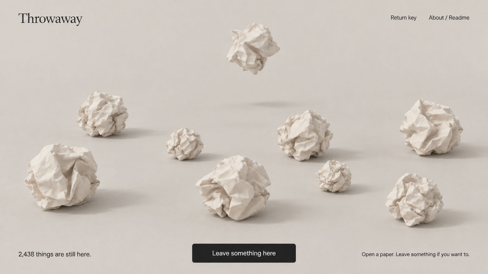

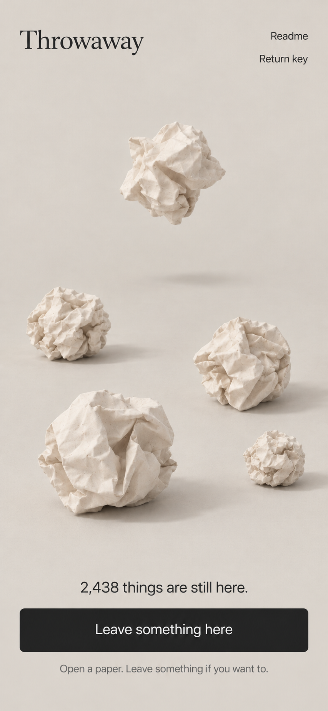

Demo source: [item-develop/paper-crumple-demo](https://github.com/item-develop/paper-crumple-demo). Retain the MIT attribution and THIRD_PARTY_NOTICES. Extend the existing wrapper rather than replacing its crumpled geometry with a simplified ball.

The target is real, dry, uncoated paper with fine fibers. Creases create geometric shadows and the surface has subtle grain. Avoid plastic, metallic or oily highlights. Do not turn the paper into dirty parchment or use large noise patches to conceal geometry problems.

Current source already uses `roughness: 1`, `metalness: 0` and a bump map. **Repeating a roughness value of 1 does not demonstrate that excessive brightness has been fixed.** Inspect albedo, ambient and fill lights, exposure, tone mapping, texture scale and shadows, then compare with D01.

- Keep the material nonmetallic and highly rough. Do not add clearcoat or restore the demo's strong reflective environment.
- Avoid near-white albedo that loses highlight detail. Maintain a gentle but visible brightness difference between paper and ground.
- Start with subtle fiber bump strength and judge close-up screenshots. It must not resemble stone or sandpaper.
- Use a soft main light, restrained fill and contact shadows. Adjust the current lighting system before adding a post-processing pipeline.
- Make a new paper visible soon after its event, entering near the upper part of the current viewport. Do not let it fall invisibly for several seconds.
- Keep world coordinates, collisions, camera and dragging local. Do not broadcast per-frame transforms.
- Bound pixel ratio, active rigid bodies and shadow cost on mobile. Avoid unlimited mesh or texture growth for material detail.
- Retain the accessible fallback when WebGL is unavailable and give it the same real-time state updates.

### 5.3 HTML paper and scene transitions

Body text remains in HTML and must not become a WebGL texture. The images establish material and layout targets. Reuse existing separate textures and lightweight masks / clip-paths where appropriate. Decorative layers must not intercept clicks; text and focus outlines stay clear.

Read opening and closing may retain the demo's folding transition, but the final form and reading area must be stable, rectangular and readable. Recalculate layout after resizing; do not make HTML text track deforming mesh vertices and become distorted, clipped or displaced.

## 6. Routes, pages and dialog tasks

The only public page routes are `/` and `/readme/`. Write, Read, confirmation, reporting and return-key views are states within `/`. Do not add shareable `/paper/:id`, `/write` or personal pages.

### 6.1 Shared space — D01 / M01

Technology: React state + local Three.js / cannon-es scene + SSE.

- Retain Throwaway at the top. Show Return key and About / Readme on desktop; adapt the mobile arrangement using M01 rather than squeezing everything into one row.
- Show the current active-paper total at the bottom, using server data. It is neither cumulative submissions nor the number of rendered objects.
- `Leave something here` opens Write. Hide this action during reading or writing while keeping the total visible outside the sheet.
- Insert new-paper events directly into the current window; do not discard them through random sampling. Keep content closed and do not automatically open Read.
- On entry or continued exploration, obtain a random window from the active pool and choose positions locally. Explore through dragging / moving the window, without Load more or Next buttons.
- The window may grow slowly with the total but must have device limits. Begin performance evaluation around 8–24 papers on desktop and 5–10 on mobile, showing the actual available number when fewer exist. These ranges are proposals, not measured performance guarantees.
- When a new paper arrives, preferentially replace an unopened old paper to stay within the budget. Never evict the currently read paper. Concurrent arrivals at pod scale must appear promptly without a queue lasting several seconds.
- Use `Finding the space…` for initial loading. Connection status must not become a visitor leaderboard.

### 6.2 Write — D02 / M02

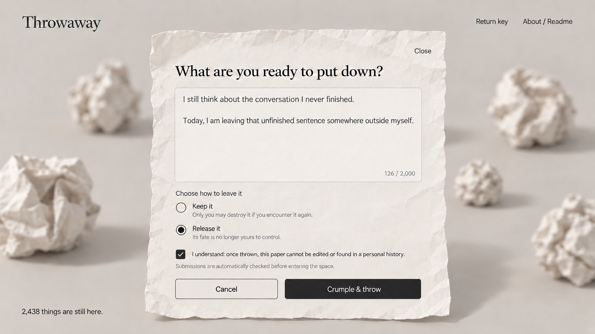

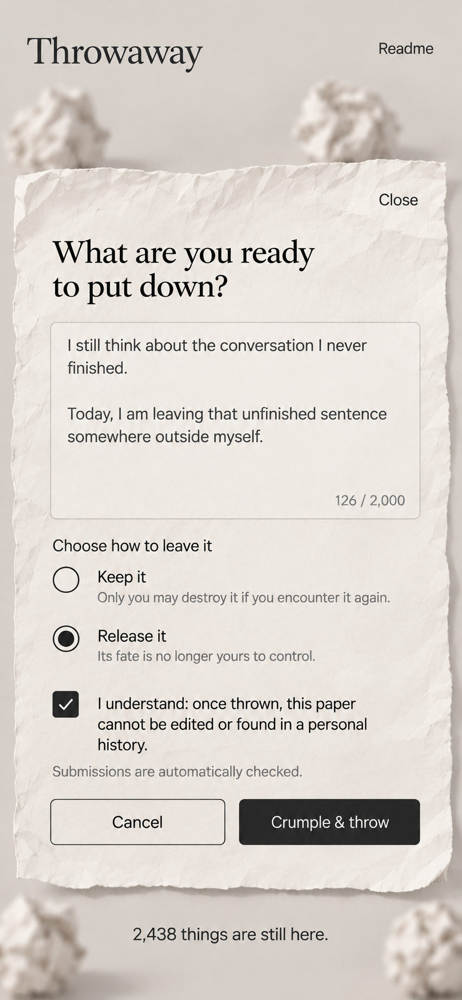

Technology: existing WriteDialog + native textarea, radio controls and checkbox + HTTP; CSS paper surface and demo crumpling.

Implementation order: Close → heading → textarea / character count → Keep / Release → immutability and no-history confirmation → moderation explanation → Cancel / Crumple & throw.

- Retain the limit of 2,000 Unicode code points consistently on client and server. Do not count emoji incorrectly using UTF-16 length.
- Initial state: no selected mode and an unchecked confirmation. The selected Release in the image represents a later interaction state.
- Require nonempty text within the limit, an intentional mode selection and the checked confirmation before submission.
- Keep copy: `Only you may destroy it if you encounter it again.`
- Release copy: `Its fate is no longer yours to control.`
- Moderate the final submission payload. Persist and broadcast only after approval; earlier client prechecks cannot replace final server checks.
- Use `Checking…` / `Saving…` while waiting and prevent duplicate submission. Do not animate a successful throw or increment the total before saving.
- Reuse the submission_key for retries of the same pending content. Do not change the key and resubmit when the outcome is unknown.
- Before changing content or mode after an unknown outcome, query or recover that submission's status. A new key is not a way to guess whether saving succeeded.
- Preserve the draft, mode and confirmation on validation or network failure and show an English explanation. Reconnection must not clear the draft.
- After success, clear the draft and crumple / throw the confirmed paper. Deduplicate the HTTP response and SSE event into one object.
- Do not persist a personal draft archive or introduce browser body-text caching. Cancel can discard unsent content, without claiming to withdraw a submitted paper.

### 6.3 Read / Witness — D03 / M03

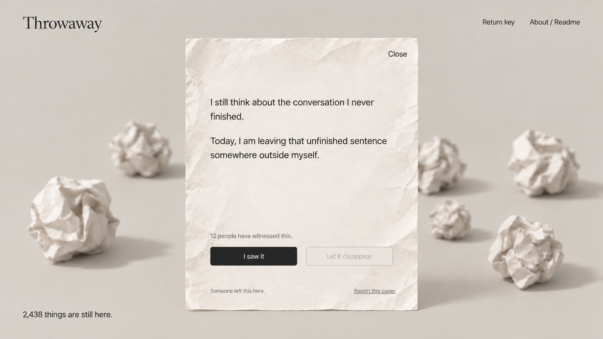

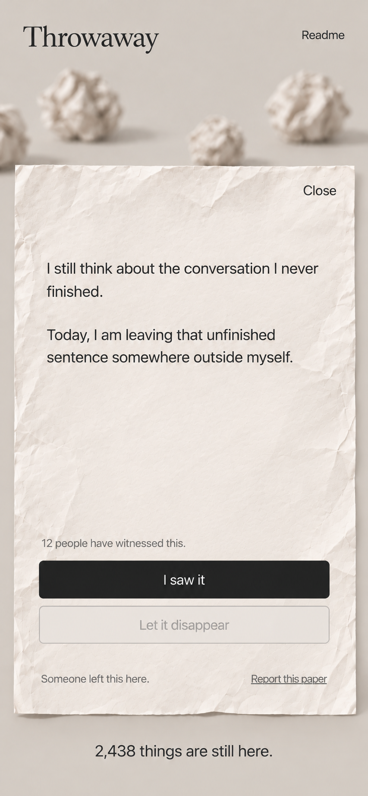

Technology: existing ReadDialog + HTTP for content and private permissions + SSE reconciliation.

- Request body text only after deliberate opening. Render text with preserved paragraphs, without interpreting it as HTML.
- Do not add post titles, author avatars, timelines or decorative labels to the content.
- GET returns paper state, mode, witness_count and the current identity's has_witnessed / can_burn. Do not expose the owner identity publicly.
- To enforce opening before witnessing / destruction, GET also issues a short-lived read_receipt bound to the current identity and paper ID. Witness, burn and report requests supply it; the server checks signature, identity, expiry and ACTIVE status. Sign with a persistent server secret, without introducing public reading counts or browsing history. Do not bind the receipt to a version changed by another person's witnessing, which would invalidate an unrelated reader's eligibility. It proves that content was retrieved, not that a human finished reading; do not introduce mandatory reading timers to imply that guarantee.
- Opening does not increase the count. After a successful `I saw it` action, show `Witnessed` or another nonrepeatable acknowledgement state.
- Keep, ordinary reader: witnessing is available, destruction is absent. Keep, author: show `You left this here.` and use the owner flow in Section 6.4.
- Release: destruction is disabled before witnessing and becomes available after acknowledgement. The author receives no extra rights.
- Resolve the original plan's ambiguity as follows: a Release author may acknowledge witnessing to qualify for ordinary-visitor destruction, but does not contribute to witness_count. Distinguish acknowledgement from count contribution in the database; do not permanently lock the author out of the flow.
- Multiple tabs using one identity count once. Enforce uniqueness on `(paper_id, identity_id)` rather than SSE connection ID or session token.
- Omit witness counts from unopened-paper lists and global events. Do not announce a paper's attention on the home screen.
- Close / Escape returns to the space and restores sensible focus. Actions and closing must remain reachable while long content scrolls.

### 6.4 Normal destruction and confirmation — D07

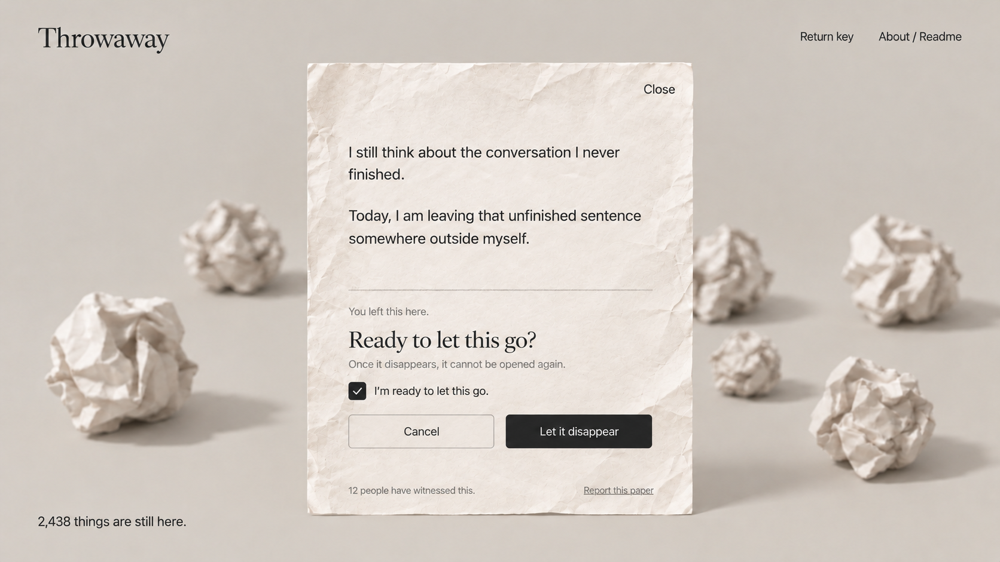

Technology: confirmation state within ReadDialog + HTTP transaction and permissions + SSE destruction event + local burning / disappearance.

- Put confirmation on the original paper surface, without nesting another dialog.
- A Keep author must explicitly check `I'm ready to let this go.` before the final destruction request.
- A witnessed Release visitor receives the same deliberate final-confirmation semantics. Do not grant author privileges or require a Keep author to witness first.
- Check identity, mode, current state, witness acknowledgement and owner confirmation on the server. Disabled frontend buttons are not permission enforcement.
- Commit destruction first, broadcast it, then animate according to client state. Animation must not control database deletion timing.
- The initiating client plays its own ending. Other active readers enter final reading; do not treat the initiator as a passive final reader.
- Prevent new openings immediately after destruction. Remove the server-accessible body copy; a minimal tombstone / idempotency record without body text may remain.
- Simultaneous destruction by two people produces one actual transition, one total decrement and one broadcast. Later requests receive a stable `paper_gone` result.
- An idempotent retry may return the same operation outcome without executing destruction again.
- Provide no bulk endpoint and do not turn burning into a game that encourages repeated destruction.

### 6.5 Destroyed by someone else while reading — D04 + M03

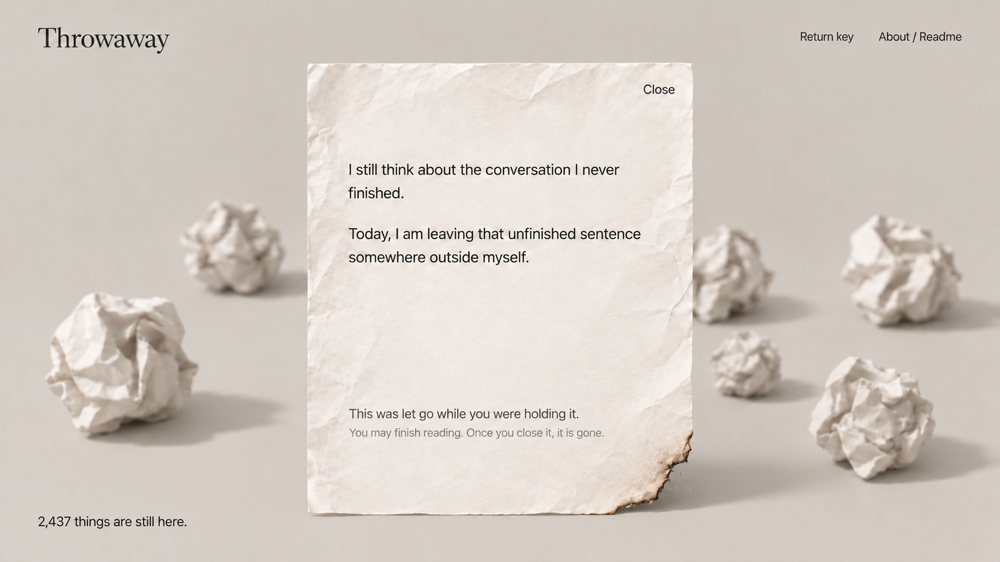

Technology: current reading copy held in React memory + SSE / reconnect reconciliation + a subtle CSS charred edge.

- Immediately update the total and mark the shared object as gone when destruction arrives. The active reader retains already-retrieved text, without fetching the full body again.
- Show `This was let go while you were holding it.` and `You may finish reading. Once you close it, it is gone.`
- Remove witness, burn and report actions, retaining only Close. The server also rejects further interactions.
- Add no forced countdown. Char only the outer edge, without covering text or burning it away word by word.
- Clear the local copy on Close, refresh or navigation away. Do not write it to localStorage, IndexedDB, the URL or persistent client caches.
- If destruction happened during a short disconnection, enter the same final-reading state once reconciliation confirms it.
- A destruction event received before an opening request completes must not allow the late body response to revive an active paper. Merge by state version; if no reading copy was established, show `This paper is no longer here.`
- Quarantine differs from destruction: clear currently displayed text and show `This paper is no longer available.`, without preserving a final-reading copy.

### 6.6 Anonymous Return Key — D05

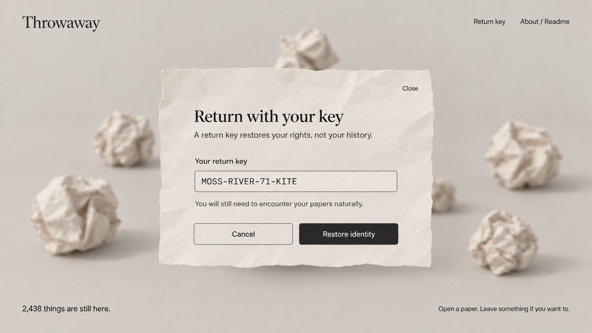

Technology: Node crypto + digest mapping in SQLite + existing anonymous session + React paper states.

- After the first successful Keep submission, offer one global return key for the anonymous identity, rather than a password per paper.
- Generate at least 128 bits of random entropy. `MOSS-RIVER-71-KITE` in the image is a typography example, not the real generation scheme.
- Store a digest in the database, never the key in logs. Show the raw key only upon successful issuance, with Copy key and `I have saved it`.
- Use D05's dimensions and material for first issuance: heading `Keep your return key`, explanation `A return key restores your rights, not your history.`, read-only key, copy action and saved confirmation. Omit the Restore identity button in this variant.
- Make issuance recoverable after a lost response. An unconfirmed key may be reissued while invalidating the previous unconfirmed key, without storing plaintext. Do not promise indefinite retrieval of a raw key.
- A returning visitor uses D05's input form. After verification, issue a new session cookie mapped to the restored identity.
- Use an ordinary English error for an invalid key without disclosing identity content or other information. Apply reasonable restoration rate limits.
- Reestablish SSE after restoration and refetch private permissions for the opened paper. Clear the previous identity's has_witnessed / can_burn caches.
- Return no owned paper IDs, history, personal counts or lists. Migrations must preserve existing anonymous identities and saved papers.

### 6.7 Reporting and automated moderation — D08

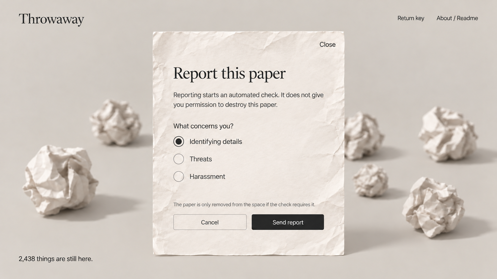

Technology: React form + Express HTTP + separate report records / moderation tasks + quarantine SSE.

- Expose reporting only after opening a paper. Switch to the report view on the same paper surface.
- Reasons: Identifying details, Threats and Harassment. Initially select none; the image's selection is an example.
- Explain that reporting starts automated review without granting destruction rights. On successful submission, show `Report received. An automated check will follow.`
- Send the paper ID and reason from the client, without copying the body into report logs.
- The report endpoint must not directly delete the paper, reduce the total or animate burning. Only a separate moderation outcome changes quarantine state.
- Deduplicate reports to prevent unlimited duplicate tasks. Retain retryable status and record the actual failure if moderation requests fail.
- Quarantined objects leave the active pool; propagate total changes live and exclude them from future encounters. Separate quarantine from normal destruction in data, logs, copy and animation.
- Do not build a human moderation dashboard, automatically rewrite submissions or persist emotional profiles.

### 6.8 Readme — D06 / M04

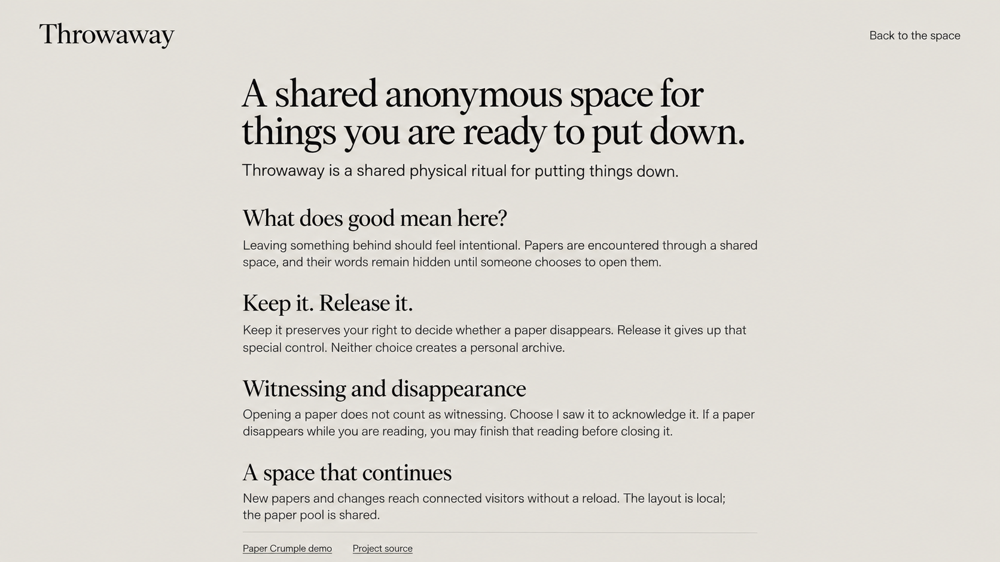

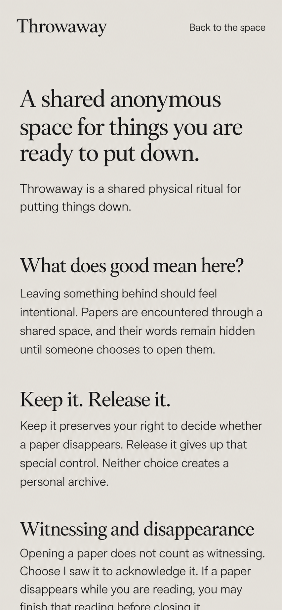

Technology: existing server-rendered Markdown and static CSS.

- Continue publishing the real README in full at `/readme/`. Retain the course's server-rendered invariant and heading-order checks.
- Use an article maximum width around 760–840px and mobile side margins around 24px. Do not reduce font size to fit a long document.
- The image text demonstrates layout; it must not replace the complete README.
- Update implementation status and deliberate omissions using the user's existing argument. Do not describe pending features as finished.
- Technical ADRs may be linked, while the main article continues to explain intentional leaving, encounters, witnessing and disappearance.
- Do not add a marketing hero, feature cards, user statistics or extra entry points.

## 7. Shared state, events and recovery

### 7.1 The server is the source of truth

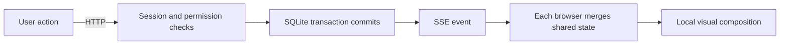

The database stores current state. SSE transports notifications; it is neither the database nor a permanent event history.

Use a minimal persistent version scheme: one shared revision row, incremented in the same transaction as every actual shared change. Events include revision, paper_id, the relevant paper version and, for total-changing events, the transaction's active_total. Send object state and its total together, rather than separate unversioned +1 / -1 events.

Creation, witness and destruction responses also carry relevant versions. Merge by paper ID, operation ID and version in React. Never let an old HTTP response overwrite newer applied state.

### 7.2 SSE event contract

| Event | Payload and client behavior |
| --- | --- |
| `space:snapshot` | revision, active_total, current-window active paper IDs / versions and the state of IDs requested for reconciliation; omit content, owner identity and witness counts |
| `paper:created` | New paper ID, version, revision, active_total and operation correlation ID; every connected space inserts a local object for that same paper |
| `paper:witnessed` | Paper ID, version and revision; global notifications omit counts and witness identities. Clients currently reading it refetch reading state |
| `paper:destroyed` | Paper ID, version, revision, active_total and operation correlation ID; remove closed objects and place passive active readers into final reading |
| `paper:quarantined` | Paper ID, version, revision and active_total; remove it from the pool and clear active reading content, without a burning ritual |

Refetch reading state immediately after a witness invalidation for the currently read paper. Coalesce closely spaced events into one request where appropriate and check response versions again. Measure the extra request's actual latency: normal pod use must update within about one second, rather than merely deliver a notification.

Do not add online lists, typing, cursors, reader counts, per-frame physics or full-text broadcast events by default. Return-key issuance and identity restoration use private HTTP responses; never broadcast keys.

### 7.3 Initial connection and reconnection

- Use one EventSource per page instance. Close it on unmount and identity changes to prevent duplicate listeners or resource leaks under React StrictMode.
- Register the event subscription before obtaining a consistent snapshot in the same server ordering. Buffer and merge subsequent events during initialization. Do not fetch random IDs and attach the stream later, leaving an update gap.
- Snapshots and events share the revision scheme; ignore stale and duplicate events. Do not arbitrarily filter revisions from the global sanitized invalidation stream and then assume consecutive revision numbers.
- Show `Reconnecting…` when disconnected. Preserve the scene and draft; pause interactions requiring server confirmation rather than pretending local optimistic updates succeeded.
- Reconcile every reconnect with a new snapshot. Submit a bounded list of rendered IDs and the currently read ID; the server returns whether they still exist and replenishes the random window.
- Preserve valid local objects and their positions where possible. Remove missing objects and update the total, rather than reshuffling the whole scene.
- Opening the next day draws a new random window without restoring personal history or yesterday's layout.
- Do not replay every throw or burn that occurred while offline. A permanent event store, Redis or a message queue is unnecessary for this behavior.
- A snapshot must recover a transaction committed before a process restarted and broadcast occurred. Persistence cannot depend solely on client event accumulation.
- Recover an unknown creation / destruction outcome with the same operation key. Establish the server's result before deciding whether to retry.

### 7.4 Connection and deployment details

Serve `text/event-stream` from Express with no caching and prompt flushing. Send lightweight comment heartbeats periodically. Remove subscribers and timers when connections close. Bound slow-client buffers; close over-budget connections so they reconnect and obtain a snapshot.

Check the Fly proxy, compression middleware and idle timeout so events are not buffered. Verify external HTTP/2: same-origin SSE under HTTP/1 has relatively low multi-tab connection limits. Test at least three independent browser contexts, rather than substituting dozens of tabs in one browser for multiple users.

Automatic stopping can make cold starts and restart recovery slower than normal propagation between already-connected foreground sessions. Record cold-start and connected-session latency separately. Preserve the course deployment arrangement unless the user requests a change.

## 8. Data model, migration and concurrency

Read the existing schema before implementing repeatable, versioned migrations. Verify them on a local copy of the old database. Do not DROP the running database or clear saved papers. Confirm and verify production migration and backup handling separately during actual deployment.

| Data | Minimal extension |
| --- | --- |
| identities / sessions | Preserve existing identity and cookie mappings; add a return-key digest and necessary issuance state, without public user profiles |
| papers | Add mode, active/destroyed/quarantined status, version and necessary lifecycle timestamps; preserve existing content and submission_key semantics |
| witness acknowledgements | Unique paper_id + identity_id; track acknowledgement and count contribution. Authors may acknowledge without contributing |
| reports | Paper ID, reporter identity, reason, review state and necessary timestamps; independent of witness and burn |
| shared metadata | Monotonically increasing revision; calculate total from active state, or maintain it transactionally with a recomputation check |
| Idempotent operations | Retain submission_key for creation; use an operation key for destruction and a minimal body-free result for lost responses |

Proposed historical migration: old papers have no intentional Keep / Release selection. Conservatively backfill `KEEP` and preserve owners, avoiding a sudden right for strangers to destroy existing content. Record this migration choice in ADR / PROCESS without claiming old users selected Keep.

Idempotent creation comparisons include content and mode. Store a request digest for conflict checks rather than relying on body text that destruction later clears. The same key with a different payload conflicts; retrying the original submission must not recreate a destroyed paper.

Creation: check identity and final moderation outcome → transactionally check prior submission → insert ACTIVE → update versions and total → commit → broadcast. Keep moderation network calls outside the transaction to avoid long SQLite locks; revalidate relevant state before committing.

Witnessing: check ACTIVE and current identity → insert a unique acknowledgement → determine count contribution from authorship → update version → commit → notify. A repeat request returns existing state without another count increment.

Destruction: within one transaction, check ACTIVE, KEEP ownership / RELEASE acknowledgement and confirmation → perform one conditional transition from ACTIVE → clear server-accessible content → update revision / total → commit → broadcast once.

Concurrent witnessing and destruction follow actual transaction order. If destruction commits first, no witness may be added; if witnessing commits first, it does not block destruction. Do not introduce collaborative text editing, locks or CRDTs for immutable papers.

## 9. HTTP interface contract

These are target contracts. Extend the current endpoints where possible and retain `/api/session`, `/api/papers` and `/api/papers/:id`. Add files as needed without first building a general framework.

| Endpoint | Contract |
| --- | --- |
| POST `/api/session` | Ensure a server-side anonymous session; retain HttpOnly cookies. The client does not supply owner IDs |
| GET `/api/papers` | Bounded random active IDs, active_total / revision; no body text, witness_count or author lists |
| GET `/api/papers/:id` | Content after deliberate opening, mode, version, current identity's reading / action state and read_receipt; omit public owner identity |
| POST `/api/papers` | content, mode, confirmation and submission_key; final moderation and persistence; return ID, versions and authoritative total |
| GET `/api/events` | Same-origin SSE; initial / reconnect snapshot and live events; may accept a bounded list of current-window IDs for reconciliation |
| POST `/api/papers/:id/witness` | read_receipt and a unique acknowledgement by server identity; return private state and count/version |
| POST `/api/papers/:id/burn` | read_receipt, operation key and explicit confirmation; check rights on the server and perform at most one transition |
| POST `/api/identity/return-key` | Issuance after the first Keep / recovery of unconfirmed issuance; private current-identity flow without paper lists |
| POST `/api/identity/restore` | Verify the key and issue a new session; return no owned paper IDs, then reconcile SSE and permissions |
| POST `/api/papers/:id/report` | read_receipt, valid reason, rate limiting and deduplication; start separate review without granting destruction rights |

Use understandable JSON error codes such as invalid_input, unauthenticated, forbidden, paper_gone, submission_conflict, moderation_rejected and service_unavailable, alongside the existing English error field where appropriate. Do not match API state to UI solely by parsing natural-language messages.

Disable persistent caching for body and reading-state responses. Destruction responses must not include full text. Missing papers or those removed from the shared space cannot be fetched anew: GET may return a stable 404; interaction requests may return 409 / 410 with paper_gone. GET never implicitly records a witness.

## 10. External moderation: an explicit implementation prerequisite

The original plan requires automated moderation but does not settle a provider, model, credentials, actual coverage or response cost. **Image copy and a local fake-pass implementation cannot fulfill this feature.** This document does not assume a service is already connected.

Before implementing this phase, check for a usable existing service. Propose a minimal real integration with its provider, API, configuration and detection scope, then connect it within the user's existing authorization. Do not open paid accounts independently or commit secrets. Continue independent phases while this dependency is unresolved.

Moderation contract:

- Input: the user's final submitted text. Output: allow / reject / service_unavailable with limited reasons.
- Check targeted threats, harassment and exposure of identifiable third parties. Ordinary regret, anxiety or negative emotion must not be rejected merely for being negative.
- Rule checks for contact details may supplement the service. Do not claim a generic moderation endpoint or a few regular expressions cover all privacy and contextual judgments.
- Rejected content stays out of the shared pool: no creation event or total increase. Preserve the editable draft.
- If moderation fails or is unconfigured, show `This paper could not be checked. Please try again.` Do not silently accept and claim it was checked.
- Support automated rechecks and high-confidence quarantine with enough operation state to retry, without introducing a complex workflow service by default.
- Disclose automated checking and the third-party service before submission. Retain only necessary safety state; do not generate emotional profiles or rewrite content.
- Use a controlled service substitute for local allow/reject/error tests. Production must use the real service; a test substitute is not the delivered feature.

If no real service is configured, report the phase's specific gap. Completed C9 real-time and multi-user behavior must not be described as a completed Final MVP.

## 11. Implementation entry points in the current repository

Read-only inspection as of 2026-10-08 found anonymous sessions, SQLite persistence, idempotent creation, a random ID window, HTML reading / writing and a Three.js demo wrapper. No real-time dependency was found. App currently hides the entire footer while Read / Write is open; change that to hide only the main action and preserve the total.

The paths below are relative to the actual repository root, regardless of the directory containing this plan.

| Existing file | What to inspect / extend |
| --- | --- |
| `src/App.tsx` | SSE lifecycle, version merging, draft / reading state, total while busy, reconciliation after identity restoration |
| `src/lib/api.ts` | Request contracts, submission_key retries, event types, English errors and versions |
| `src/components/WriteDialog.tsx` | Keep / Release, confirmation, moderation waiting, unknown-outcome recovery, D02 / M02 |
| `src/components/ReadDialog.tsx` | Witnessing, permissions, confirmation, reporting, final reading, stale-response races, D03 / D04 / M03 |
| `src/components/PaperField.tsx` | Created / destroyed scene entry points, window budget, active-paper protection and synchronized fallback |
| `src/scene/vendor/paper-scene.js` | Material / exposure review, local animation, immediately visible arrivals, removal and cleanup |
| `server/db.ts` | Versioned migrations, constraints, revision, minimal tombstones and idempotency metadata |
| `server/papers.ts` | Active queries, mode, private reading state, transactional checks and post-commit broadcasts |
| `server/session.ts` | Identity continuity, return-key flow, cookies and rate limits |

Add a small SSE module and identity-recovery component only as needed. Do not begin with a global state library, generic repository layer, event-sourcing framework, room system or new UI suite.

## 12. Claude's implementation phases, deliverables and acceptance

For each phase, explain the changes and their purpose, run the relevant verification, record actual outcomes and make a small, explainable commit. Do not manufacture a retrospective commit timeline or repeatedly polish unrelated files.

| Phase | Claude's work | Verification and deliverables |
| --- | --- | --- |
| P0 — Take over | Inspect working-tree state and user changes; read original product sources, current code and references; update outdated harness scope; record stack and migration choices | Existing working flows remain functional; scope and external moderation gaps are explicit |
| P1 — Real-time foundation | Minimal migration, shared revision, SSE snapshot / live events, version merging, visible live arrival and a total outside dialogs | The same paper appears across three independent sessions within about one second after successful submission; reconnect reconciles; failed saving does not broadcast; D01/M01 |
| P2 — Modes and witnessing | Extend Write, immutable mode, unique acknowledgement, private reading permissions and live witness updates | Different identities and same-identity tabs; author count rules; illegal edits rejected; D02/D03/M02/M03 |
| P3 — Destruction and final reading | Transactional permissions, idempotent destruction, live removal, final-reading state and late-response merging | Simultaneous destruction decrements once; unauthorized requests fail; readers may finish but cannot reopen after closing; D04/D07 |
| P4 — Return keys | Global key issuance after the first Keep, lost-response recovery, cross-device restoration and permission-cache clearing | Another browser recovers the same rights; no history returned; SSE uses the correct identity before and after restoration; D05 |
| P5 — Automated safety flow | Real moderation integration, submission blocking, independent report review / retry and quarantine events | allow/reject/error; reporting itself does not delete; quarantine propagates live; D08; explicitly incomplete if the real service is unconfigured |
| P6 — Visuals and accessibility | Compare every relevant reference: paper material, Read / Write, mobile, long content, soft keyboard, reduced motion and fallback | Actual screenshots compared with their references at least at five concrete points; an unsupported claim of visual similarity is insufficient |
| P7 — Documentation and release | Update README / harness / ADR / PROCESS to actual behavior; pass relevant checks and deploy within implementation-task authorization | Local checks, deployed three-session verification and restart persistence; record only real commits, gaps and evidence |

Prioritize P1–P3 and associated documentation for C9. P4–P7 complete the full Final MVP path. If the implementation task requests the full MVP, continue through these phases rather than stopping after establishing an SSE connection.

## 13. ADRs, process and verifiability

### 13.1 Main multi-user behavior ADR

Suggested future file: `docs/adr/002-active-reader-final-read.md`. It is planned, not created in this document-only delivery.

Decision: normal destruction changes shared state immediately, while a current reader who already retrieved the text may finish that reading. It disappears for them on closing.

| Option | Benefit | Cost |
| --- | --- | --- |
| Clear text immediately | Strongest disappearance; simpler client state | Interrupts deliberate reading, resembles a fault and weakens witnessing |
| Prevent destruction while someone reads | Uninterrupted reading | Another person's connection occupies destruction rights; requires reading leases, timeouts and connection management |
| Immediate destruction + local final reading (selected) | Destruction rights take effect immediately while respecting current readers | Retrieved text remains temporarily readable; disable interaction and clear the local copy |

Ground this in the README's intentional leaving, deliberate witnessing and consequential disappearance. State the cost honestly: text already retrieved by a reader cannot be revoked. The guarantee is that it cannot be retrieved anew or interacted with further. Safety quarantine does not receive the final-reading exception.

A second short ADR may cover `SSE + HTTP`, snapshot recovery, shared data / local coordinates and the Keep backfill for older papers. A transport-only ADR must not replace the multi-user behavior decision above.

Use Context, Options, Decision, Consequences and Verification, recording actual status. Reference: [Documenting Architecture Decisions](https://cognitect.com/blog/2011/11/15/documenting-architecture-decisions).

### 13.2 Process and logging

- Rewrite PROCESS as an overview of the actual current process, citing real commits / comparisons. Do not describe this plan as executed work.
- Check the official 400–600-word README and 900–1100-word PROCESS requirements. The user drafts and confirms the argument and experiences; Claude helps verify implementation status, sources and evidence without inventing personal judgments. The COMP8020 research-note remains the user's separate writing task and is not automatically drafted under this implementation plan.
- Record how the user set scope, why SSE was selected, how visual or concurrency problems were identified and corrected, and how the harness / checks changed.
- The user completes `reflections/crit-9.md` from actual experience. Do not invent experiences, tutor comments or pod feedback.
- Server logs include time, internal anonymous identity, action, paper ID, outcome and revision. Record actual create, witness, burn permitted/denied, destroy, report, quarantine and connect/disconnect actions.
- Exclude content, session cookies, return keys, credentials and drafts from logs. Do not log idempotent retries as new successful creations.

### 13.3 Required verification matrix

| ID | Scenario | Passing condition |
| --- | --- | --- |
| R1 | A creates; B/C are connected foreground sessions | B/C actually see the same closed new paper and total change within about one second, without reload or automatic text opening |
| R2 | A loses its creation response or SSE arrives first | One paper per submission key; old HTTP totals cannot overwrite a newer revision |
| R3 | B/C witness concurrently | Each distinct identity counts once; same-identity tabs contribute once; opening contributes nothing |
| R4 | The author witnesses | Acknowledgement succeeds without increasing the count; a Release author gains ordinary-visitor destruction eligibility |
| R5 | Invalid destruction | Missing / invalid read receipt, non-owner Keep and unacknowledged Release requests fail on the server; all sessions retain state |
| R6 | B/C destroy concurrently | One transition and one decrement; the later request consistently reports the paper gone, without negative totals or repeated animation |
| R7 | B reads while C destroys | B receives the final-reading notice within about one second; may finish, cannot interact and cannot retrieve again after closing |
| R8 | Offline creation / destruction and process restart | Reconnection recovers database facts without replaying all animations, reviving destroyed papers or losing drafts |
| R9 | GET races with destruction | Late text cannot revive a paper; an old request cannot reopen an ended reading |
| R10 | Identity restored in another browser | Same ownership / witness rights; no My Papers or history response; old-identity permissions cleared |
| R11 | Moderation and reporting | Rejected submissions do not broadcast; reporting itself does not delete; quarantine propagates separately and clears current text; failures are honestly shown |
| R12 | Refresh / restart / redeploy | Active papers, modes, witnesses, identities and versions persist; destroyed text cannot be retrieved again |
| V1 | 1920×1080, laptop and 390×844 | Material, layout, type and spacing match relevant references; reachable actions and no horizontal overflow |
| V2 | Long content, emoji, long words, resize and soft keyboard | Undistorted text and reachable buttons; no lost drafts or duplicate connections from scene restarts |
| A1 | Keyboard, focus, Escape, reduced motion and no WebGL | Accessible interaction and sensible restored focus; reduced motion preserves behavior; fallback receives real-time updates |

Measure latency from server-confirmed submission to actual visibility in another already-connected foreground session, recording environment and results. Also observe the complete wait from the user's action. Broadcast logs alone are insufficient visual evidence. Do not promise one second across arbitrary networks, frozen background tabs or disconnections.

Retain `spec/invariants.test.ts` and valid business checks. Run data-creating / destroying tests against an independent temporary database; never point test APP_URL at production. Run checks relevant to the change, fix failures and recheck without repeatedly rerunning the entire suite without reason.

Use the existing project commands during implementation: `pnpm dev:server`, `pnpm dev`, `pnpm build`, `pnpm start` and `pnpm check`. Follow the actual configuration for launch procedures and ports. This document delivery did not start or test the application.

Use Browser / IAB first when available; otherwise record the reason and use Playwright. Compare actual screenshots and references side by side, checking at least paper brightness / texture, sheet dimensions, paragraph spacing, button hierarchy and mobile layout. Claim visual completion only after confirming the match.

## 14. Exact English copy and example

Use the following body only for local visual fixtures or an existing demo authorized by the user. Do not add it to the live shared pool or replace production papers merely to capture reference screenshots.

```text
I still think about the conversation I never finished.

Today, I am leaving that unfinished sentence somewhere outside myself.
```

| Purpose | Copy |
| --- | --- |
| Main action | Leave something here |
| Write heading | What are you ready to put down? |
| Empty input | Write something you have been carrying. |
| Mode label | Choose how to leave it |
| Keep explanation | Only you may destroy it if you encounter it again. |
| Release explanation | Its fate is no longer yours to control. |
| Submission confirmation | I understand: once thrown, this paper cannot be edited or found in a personal history. |
| Moderation explanation | Submissions are automatically checked before entering the space. |
| Submission action | Crumple & throw |
| Witness | I saw it / Witnessed |
| Witness count | {n} people have witnessed this. (For n=1, use person has.) |
| Ordinary origin note | Someone left this here. |
| Keep author | You left this here. |
| Final confirmation heading | Ready to let this go? |
| Keep author confirmation | I'm ready to let this go. |
| Destruction action | Let it disappear |
| Final reading | This was let go while you were holding it. |
| Final-reading explanation | You may finish reading. Once you close it, it is gone. |
| Return-key principle | A return key restores your rights, not your history. |
| Return-key entry heading | Return with your key |
| Recovery action | Restore identity |
| Reporting | Report this paper / Send report |
| Reconnection | Reconnecting… |
| Missing paper | This paper is no longer here. |
| Moderation quarantine | This paper is no longer available. |
| Total | {n} things are still here. (For n=1, use thing is.) |

## 15. Definition of completion and handoff

Claude's implementation handoff must distinguish implemented, locally verified, production-verified and still unconfigured or unverified. Do not collapse all of these into a single claim of completion.

- C9: actual cross-session changes within about one second, a multi-user behavior ADR, deployed verification and factual PROCESS / reflection evidence.
- Full MVP: all default core features and checks in this plan are completed and real moderation is connected. Optional Gallery / AI features are not completion conditions.
- Visuals: compare actual rendering with the relevant D01–D08 / M01–M04 areas. Preserve realistic matte crumpled paper and sheets, without sacrificing text or buttons to texture / animation.
- Data: migrations preserve old content and identities. Retries, disconnections and redeployment must not duplicate creation, revive destroyed papers or incorrectly decrement totals.
- Scope: no profiles, history queries, social mechanics, shared world coordinates or unnecessary architecture layers.

The image-generation record below traces the design references. It is not evidence of implementation or application testing.

## Appendix A. Image-generation record and full prompts

These 12 images were generated with the built-in image_gen tool, using the earlier visual references and extending them to cover complete product states. The full generation prompts are recorded below. D02 also received one edit solely to correct English spelling. The images are design references, not evidence of implemented interfaces.

<details>
<summary>01-space-desktop.png — generation prompt</summary>

```text
Use case: ui-mockup. Create ONE realistic implementable full desktop website screenshot for Throwaway, 16:9 viewport. The attached image is a STYLE AND LAYOUT REFERENCE ONLY, not something to paste as a background in a real app. Preserve its calm beige-grey monochrome direction, spacious scene, simple typography, header and footer positions. Develop the shared-space state for the complete real-time product. Top left readable serif wordmark "Throwaway"; top right simple text links "Return key" and "About / Readme". Bottom left "2,438 things are still here."; bottom center dark charcoal rectangular button "Leave something here"; bottom right small sentence "Open a paper. Leave something if you want to." Show 8 realistic irregular crumpled paper balls distributed organically across a light warm-grey infinite ground, with depth but little distortion and plenty of breathing room. One paper ball entering from above near upper-middle, no arrows or labels, its text hidden. Material is real dry uncoated ivory writing paper: visible very fine cellulose fibre, matte, diffuse light, restrained creases, shaded fold interiors. Crucially reduce brightness and contrast versus the reference: no blown white highlights, no polished plastic, no glossy specular sheen, no metallic foil, no translucent paper. Soft broad natural lighting, restrained contact shadows. Front balls must be moderate in size and entirely visible, not enormous hero props. Background #e7e4de, paper near #eee9df, ink #292927. Serif Georgia-like brand, sans-serif English UI labels. Every visible UI string is ordinary implementable text, no Chinese, no fake avatars, no timestamps on balls, no witness numbers on balls, no feed, no extra interface, no browser chrome or device frame. This is a full screen concept screenshot, not a mood board.
```

</details>

<details>
<summary>02-write-desktop.png — generation prompt</summary>

```text
Use case: ui-mockup. Generate ONE realistic complete desktop website screenshot, 16:9, for the WRITE state of Throwaway. Input image 1 is the earlier writing layout reference, input image 2 is the NEW visual system reference. Preserve the new reference's quiet warm grey ground #e7e4de, matte ivory paper and simple header: Throwaway at upper left, Return key and About / Readme at upper right, global counter at lower left. The background contains softly defocused matte realistic paper balls with subtle diffuse shadows. Center one single unfolded writing sheet, about 760px wide in a 1672px viewport, comfortably inside all screen edges with generous paper margins and a subdued soft shadow; not a generic rounded white modal. Paper is subtly irregular edged, thin, dry fibrous uncoated ivory, low brightness, lightly wrinkled, gentle fold lines not noisy or dirty. No plastic/glow/specular highlights. Clean implementable HTML controls sitting on paper, no borders around each paragraph.
Exact English UI: small top-right "Close"; heading "What are you ready to put down?" in Georgia-like serif at about 30px. Large bordered transparent textarea 220px tall with legible sans-serif content exactly "I still think about the conversation I never finished.

Today, I am leaving that unfinished sentence somewhere outside myself." as two paragraphs and small bottom-right "126 / 2,000". Below it, compact label "Choose how to leave it" then two adjacent ordinary radio choices, not thick cards: "Keep it" with "Only you may destroy it if you encounter it again." and "Release it" with "Its fate is no longer yours to control." Release it selected, Keep it unselected. Under choices, readable checkbox checked with copy "I understand: once thrown, this paper cannot be edited or found in a personal history." Below that, one small quiet line "Submissions are automatically checked before entering the space." Footer actions Cancel outline and Crumple & throw dark charcoal, horizontally aligned. All controls and copy fit visibly without overlap. Maintain typography hierarchy and generous spacing yet a compact useful modal. Counter outside sheet "2,438 things are still here." No invented headings, no Chinese, no avatar, no decorative badges, no browser frame. This image is the implementation reference for layout, texture and spacing.
```

Final spelling correction:

```text
Edit the supplied Throwaway desktop Write reference image with one narrowly scoped correction. Preserve every layout coordinate, paper material, background object, colour, lighting, typography, button, checkbox, radio choice, header, footer and character counter. In the SECOND paragraph of the textarea, correct the misspelled word "outsde" to "outside" so the exact sentence is "Today, I am leaving that unfinished sentence somewhere outside myself." Keep all remaining text unchanged. Do not reflow the interface or add anything. Preserve 16:9 dimensions, matte paper texture and all boundaries.
```

</details>

<details>
<summary>03-read-desktop.png — generation prompt</summary>

```text
Use case: ui-mockup. ONE high-fidelity implementable full desktop browser viewport screenshot, 16:9, of Throwaway's READ released-paper state. Input 1 is the established reading composition reference, input 2 is the new full-product matte paper visual system. Preserve the soft warm-grey #e7e4de ground, matte realistic ivory paper balls softly out of focus behind the sheet, black serif Throwaway at top left and small Return key / About / Readme links top right. Global footer count remains visible outside the sheet, lower left, "2,438 things are still here." Center a single unfolded dry textured writing sheet roughly 630px wide and 700px high, generous 64px internal margins, thin and slightly irregular edges, subtle fold lines and paper fibres. Keep its brightness low and diffuse; no shine, no glass, no glossy bevels, no giant shadow, no dirt, no curled parchment. It should feel comfortable to read. Small Close link inside top right. Original two paragraphs in very readable dark sans-serif, 23px approximate, line-height 1.6, aligned left near upper third:
"I still think about the conversation I never finished."
"Today, I am leaving that unfinished sentence somewhere outside myself."
Lots of whitespace between paragraphs and actions. At lower part of paper: quiet text "12 people have witnessed this."; below it dark button "I saw it" and pale disabled outlined button "Let it disappear", side by side and well spaced. At bottom left small "Someone left this here."; bottom right small underlined "Report this paper". This is BEFORE the current viewer confirms witnessing, so destruction is disabled even though previous visitors witnessed the paper. No title above the actual paper text, no author name, no avatars, no extra metrics, no Chinese, no phone frame or browser chrome. Simple accessible HTML UI on top of paper texture; full page, not a collage.
```

</details>

<details>
<summary>04-final-read-desktop.png — generation prompt</summary>

```text
Use case: ui-mockup. Generate ONE full desktop 16:9 screenshot for Throwaway's FINAL READ state by changing the provided read-screen reference. Preserve its exact header, overall geometry, type sizes, comfortably readable original two paragraphs, calm defocused paper-ball background and one unfolded paper sheet. This is the state after another visitor has already destroyed the paper on the server while this viewer was reading. The current viewer is allowed to finish reading. Change the global count to "2,437 things are still here." At the lower part of the sheet, replace the witness count and action-button row with a calm plainly readable two-line notice: "This was let go while you were holding it." followed by smaller "You may finish reading. Once you close it, it is gone." Remove all witness, burn and report action controls. Keep only the Close control top right. Subtly darken and fray a small area of the lower-right outer paper edge, restrained ash-brown char no dramatic flames; never cover or animate across the body text. Paper retains dry fine fibre, low brightness, warm ivory uncoated matte texture; no shine, no neon orange, no countdown, no progress bar, no disabled wall of buttons, no new banners above body text. The deleted shared object is now only a local last-reading copy, visually clear and gentle. Exact English copy only, no Chinese, no browser or device frame. Full screen reference, not a presentation slide.
```

</details>

<details>
<summary>05-return-key-desktop.png — generation prompt</summary>

```text
Use case: ui-mockup. ONE complete realistic 16:9 desktop screenshot of Throwaway's anonymous Return key recovery modal. Use the attached new shared-space image only as the visual system reference. Same warm grey ground, matte fibrous ivory crumpled papers in defocused background, same header Throwaway, Return key, About / Readme, same global count "2,438 things are still here." Central single small paper sheet about 610px wide and 440px high, softly irregular edges, barely visible fibres and folds, no glossy modern card, no plastic. Subdued dark ink, serif main heading, sans-serif controls. Inside paper upper right "Close". Heading "Return with your key" followed by concise "A return key restores your rights, not your history." Label "Your return key" then one accessible rectangular input containing "MOSS-RIVER-71-KITE" in clear monospace. Small explanatory paragraph "You will still need to encounter your papers naturally." Footer outline Cancel and charcoal "Restore identity", both readable 48px height. No personal archive, no list of owned papers, no account profile, no statistics for this user, no password field, no avatars, no Chinese. Full viewport UI reference, actual production-feasible scale. Match the sample key exactly. No device frame.
```

</details>

<details>
<summary>06-readme-desktop.png — generation prompt</summary>

```text
Use case: ui-mockup. Generate ONE realistic implementable desktop 16:9 website screenshot of Throwaway's /readme/ page, an editorial readable document page. Attached image is only the product visual-system reference: match warm-grey #e7e4de background, charcoal #292927 ink, elegant Georgia-like serif headings, restrained sans-serif UI. This is a plain open article layout, NOT a popup paper modal and NOT a landing page or card grid. Header top left Throwaway, top right text link "Back to the space". Body max-width about 840px centered with top margin 80px and large comfortable margins. One large serif heading "A shared anonymous space for things you are ready to put down." Under it, readable 18px sans-serif paragraphs and section headings with excellent spacing. Use EXACT text below, without invented claims:
"Throwaway is a shared physical ritual for putting things down."
Heading "What does good mean here?"
"Leaving something behind should feel intentional. Papers are encountered through a shared space, and their words remain hidden until someone chooses to open them."
Heading "Keep it. Release it."
"Keep it preserves your right to decide whether a paper disappears. Release it gives up that special control. Neither choice creates a personal archive."
Heading "Witnessing and disappearance"
"Opening a paper does not count as witnessing. Choose I saw it to acknowledge it. If a paper disappears while you are reading, you may finish that reading before closing it."
Heading "A space that continues"
"New papers and changes reach connected visitors without a reload. The layout is local; the paper pool is shared."
Subtle small footer link "Paper Crumple demo" and "Project source". No numeric counter on document page, no 3D paper props competing with article text, no cards, no badges, no Chinese, no author profile, no browser chrome, no device frame. Actual page content remains HTML text. Screenshot should show one readable viewport without miniature long-page type.
```

</details>

<details>
<summary>07-space-mobile.png — generation prompt</summary>

```text
Use case: ui-mockup. Generate ONE high fidelity complete mobile website viewport screenshot of Throwaway. Tall portrait aspect ratio matching a 390 by 844 CSS pixel screen, no device bezel, no browser chrome, no notch drawn. Attached desktop is the STYLE reference, adapt its design to mobile rather than shrinking it. Warm-grey matte #e7e4de ground, real dry uncoated ivory paper fibre texture, no glossy reflections, low brightness, soft diffuse light. At top left wordmark Throwaway in 30px Georgia-like serif, top right small "Readme" link; below it right aligned quiet "Return key" link if needed to fit. Screen margins 20px. Main scene shows about 5 organically distributed realistic crumpled paper balls, different apparent depths but with full moderate-size shapes, no giant cropped props. One paper arriving near upper-middle implies realtime without arrows. Keep entire bottom area uncluttered, counter just above a wide dark charcoal button. Exact English counter "2,438 things are still here."; button "Leave something here" about 50px tall with 20px side margins. Small readable helper below "Open a paper. Leave something if you want to." No papers behind button hit area. Native readable 16px UI and no text on unopened balls, no witness counts, no profile avatars, no social feed, no badges, no Chinese. Actual production-feasible mobile app composition with generous negative space.
```

</details>

<details>
<summary>08-write-mobile.png — generation prompt</summary>

```text
Use case: ui-mockup. ONE complete readable mobile WRITE-state screenshot for Throwaway, tall portrait matching 390x844 CSS viewport, no device or browser frame. Input 1 is the desktop WRITE layout; input 2 the mobile space reference. Adapt layout for phone, never scale down desktop. Warm grey #e7e4de background, one single matte dry fibrous ivory paper sheet occupying available width with 16px margins, softly imperfect edges and subtle folds; lightly defocused few paper balls behind it. No glossy highlights. Header Throwaway 28px serif at top left, Readme at top right. Global count small at bottom outside paper "2,438 things are still here." Paper top right Close, title in serif about 25px "What are you ready to put down?" on two lines. A 150px high transparent bordered textarea, its text at real 16px or larger, contains exact two paragraphs: "I still think about the conversation I never finished." and "Today, I am leaving that unfinished sentence somewhere outside myself." Small counter "126 / 2,000". Below it label "Choose how to leave it". Stack standard radio rows vertically, with small concise explanation under each: "Keep it" / "Only you may destroy it if you encounter it again." then selected "Release it" / "Its fate is no longer yours to control." Checked checkbox and text "I understand: once thrown, this paper cannot be edited or found in a personal history." One quiet line "Submissions are automatically checked." Footer Cancel outline and Crumple & throw charcoal, side by side with comfortable tap targets. All text must remain readable, form should fit naturally with calm 20px internal margins and no overlap; allow internal vertical scroll for longer real content, not a miniature screen. No fixed sheet overflowing phone edges, no nested cards, no Chinese, no avatars. The focus is a comfortable practical small-screen paper form.
```

</details>

<details>
<summary>09-read-mobile.png — generation prompt</summary>

```text
Use case: ui-mockup. ONE complete readable mobile READ-state screenshot for Throwaway, tall portrait matching 390x844 CSS viewport, no device or browser frame. Input 1 desktop reading concept is composition reference, input 2 mobile space is palette and header reference. Adapt to real phone layout, not a scaled desktop. Header Throwaway 28px serif left and Readme right. Single thin lightly imperfect-edged unfolded matte ivory sheet, 16px outer margins and at least 26px internal side margins. Soft focus dry paper balls in warm-grey background; no shine, no yellow parchment. Close at top right inside sheet. Original two paragraphs at readable 18px, line-height 1.65, ample spacing:
"I still think about the conversation I never finished."
"Today, I am leaving that unfinished sentence somewhere outside myself."
Leave comfortable open paper whitespace beneath the paragraphs. Lower region small "12 people have witnessed this." then full width dark "I saw it" button, below it full width disabled pale outline "Let it disappear" button, 48px tap heights and 12px gap. At the bottom of sheet small "Someone left this here." and underlined "Report this paper", separated comfortably. Counter "2,438 things are still here." visible below paper. This is a released paper before the current viewer has clicked I saw it. No generic modal frame or card-on-card, no author names, no avatars, no popularity decorations, no Chinese, no extra controls. Controls and text all clearly visible at realistic sizes.
```

</details>

<details>
<summary>10-readme-mobile.png — generation prompt</summary>

```text
Use case: ui-mockup. ONE realistic mobile /readme/ website screenshot for Throwaway, tall portrait matching 390x844 CSS viewport, no device frame or browser chrome. Input 1 is the desktop Readme article reference; preserve its information architecture and palette, adapting to phone. Background warm grey #e7e4de, ink #292927, serif Georgia-like headings, readable sans-serif article at 17px, line-height 1.65, 24px side gutters. Header Throwaway about 28px left, text link "Back to the space" right, can wrap neatly. Article below header with one large 30px serif title over multiple natural lines "A shared anonymous space for things you are ready to put down." Followed by "Throwaway is a shared physical ritual for putting things down." Heading 23px "What does good mean here?" then exact paragraph "Leaving something behind should feel intentional. Papers are encountered through a shared space, and their words remain hidden until someone chooses to open them." Heading "Keep it. Release it." then paragraph "Keep it preserves your right to decide whether a paper disappears. Release it gives up that special control. Neither choice creates a personal archive." It is a NORMAL SCROLLING DOCUMENT: show the first viewport with natural continuation toward the bottom, never shrink the entire desktop article to fit a phone. No counter, no paper-ball props, no decorative card grid, no texture behind body that harms readability, no giant popup paper sheet, no badges, no Chinese, no invented claims. Strong comfortable text hierarchy and open whitespace.
```

</details>

<details>
<summary>11-burn-confirm-desktop.png — generation prompt</summary>

```text
Use case: ui-mockup. ONE complete desktop 16:9 website screenshot for Throwaway's KEEP-paper owner destruction confirmation. Use the provided READ screenshot as the edit/layout reference. Keep the exact same warm grey ground, softly defocused matte paper balls, elegant Throwaway header, Return key and About / Readme links, global counter "2,438 things are still here.", single unfolded matte fibrous ivory sheet and Close control. Keep the two body paragraphs exactly "I still think about the conversation I never finished." and "Today, I am leaving that unfinished sentence somewhere outside myself." Replace the lower witness/action area with an INLINE confirmation on the same sheet, not a second modal or card. Quiet owner text "You left this here." then serif heading about 24px "Ready to let this go?" followed by small sentence "Once it disappears, it cannot be opened again." A checked ordinary checkbox with exact text "I'm ready to let this go." At bottom Cancel outline and "Let it disappear" charcoal, side by side with clear spacing and 48px height. Footer controls and original body text must fit comfortably. No large red warning panel, no countdown, no gamified flame icon, no glow, no actual burning yet, no duplicate modal, no Chinese. Paper texture must remain low contrast, dry uncoated matte with subdued creases, not glossy or plastic. Actual implementation-ready UI reference for a deliberate confirmation.
```

</details>

<details>
<summary>12-report-desktop.png — generation prompt</summary>

```text
Use case: ui-mockup. Generate ONE full 16:9 realistic desktop Throwaway screenshot for the REPORT view, inside the existing read-paper sheet. Attached read screen is layout and material reference. Preserve its exact background and header: warm grey #e7e4de ground, softly defocused matte paper balls, Throwaway, Return key, About / Readme, global counter "2,438 things are still here." Use the SAME single unfolded thin fibrous matte ivory sheet with about 640px width and 64px internal margins. Report is an alternate state of that sheet; do not add a second card on top of it and do not show the original paper body text in this reporting view. Top right Close. Large serif heading "Report this paper". Intro paragraph "Reporting starts an automated check. It does not give you permission to destroy this paper." Then label "What concerns you?" followed by three clean ordinary radio rows at readable 18px: selected "Identifying details", unselected "Threats", unselected "Harassment". Keep generous vertical gaps and no bordered cards around choices. Quiet text below "The paper is only removed from the space if the check requires it." Footer side-by-side outline Cancel and dark charcoal "Send report". No burn button, no flame icon, no danger-red entire window, no avatars, no Chinese, no browser chrome. Dry matte paper with barely visible fibres and subdued fold lines, no gloss, no dirty parchment. This must look comfortable and buildable with HTML controls, full page UI concept not a slide.
```

</details>
